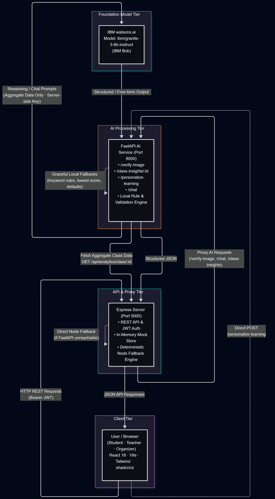

# Architecture

## System Architecture

## Components

| Component | Technology | Responsibility |
|---|---|---|
| **Frontend** | React 18, Vite, Tailwind CSS, shadcn/ui, Framer Motion, Recharts | Three role-scoped dashboards (Student, Teacher, Organizer); quiz, crossword, missions, leaderboard, AI Mentor chat, verification review, class insights |
| **Express Server** | Node.js, Express — in-memory mock data | REST API (`/api/...`), JWT auth mock, proxy to AI service with Node-side fallback for all AI routes |
| **AI Service** | Python 3, FastAPI, Uvicorn | Mission verification, personalised learning, teacher class insights, eco mentor chat — calls IBM Bob for reasoning/explanation, deterministic rules stay local |
| **IBM Bob** | watsonx.ai · `ibm/granite-3-8b-instruct` | Generates student & teacher explanations for verification results, prioritised class action items, personalised topic recommendations, free-form mentor chat replies |

## Pages & Routes

### Student
| Page | Route | IBM Bob feature |
|---|---|---|
| Dashboard | `/student` | — |
| Learn | `/student/learn` | — |
| Quiz | `/student/quiz/:topicId` | — |
| Eco Crossword | `/student/crossword` | — |
| Missions | `/student/missions` | `POST /verify-image` → Bob explanation on submission result |
| AI Mentor | `/student/mentor` | `POST /chat` → Bob free-form eco answers |
| Badges | `/student/badges` | — |
| Leaderboard | `/student/leaderboard` | — |

### Teacher
| Page | Route | IBM Bob feature |
|---|---|---|
| Dashboard | `/teacher` | — |
| Task Allocation | `/teacher/tasks` | — |
| Verification Review | `/teacher/verification` | Displays Bob-generated teacher explanation per submission |
| Performance | `/teacher/performance` | — |
| AI Class Insights | `/teacher/insights` | `GET /ai/class-insights/:id` → Bob-generated prioritised action list |

### Organizer
| Page | Route |
|---|---|
| Dashboard | `/organizer` |
| Competitions | `/organizer/competitions` |
| Analytics | `/organizer/analytics` |

## Data Flow

### 1 · Mission Verification (Student submits photo evidence)
1. Student uploads a photo on **MissionsPage** → `POST /api/ai/verify-image` → Express
2. Express proxies to **FastAPI** `/verify-image`; falls back to Node rule engine if AI service is down
3. FastAPI applies **deterministic checks**: MIME validation, file-size penalty, off-topic keyword detection
4. Deterministic result (confidence, detected objects, verified bool) is passed to **Bob** via `bob_service`
5. Bob generates `student_explanation` and `teacher_explanation` (1–3 sentences each)
6. Response returned to browser; stored for teacher review on **VerificationPage**

### 2 · AI Class Insights (Teacher requests analysis)
1. Teacher opens **InsightsPage** or clicks "Regenerate AI Analysis" → `GET /api/ai/class-insights/:classId` → Express
2. Express proxies to **FastAPI** `/class-insights/:classId`; falls back to Node data-grounded actions if AI service is down
3. FastAPI fetches aggregate class summary from Express (`GET /api/analytics/class/:id`) — **no student names exposed to Bob**
4. If summary has enough signal, FastAPI builds a compact context (topic scores, pending count, participation trend) and calls **Bob**
5. Bob returns up to 3 prioritised `ActionItem` objects (`priority`, `title`, `reason`, `recommended_action`)
6. FastAPI validates the response (required keys, high-priority guard for pending verifications); falls back to `_fallback_insights` if invalid
7. Structured JSON returned to browser; rendered as priority-colour-coded cards

### 3 · Personalised Learning (Student requests recommendation)
1. Student visits **AI Mentor** page → `POST /api/personalize-learning` → FastAPI directly
2. FastAPI builds a student-scoped context (topic scores, completed lessons, mission activity) and calls **Bob**
3. Bob returns `recommended_topic`, `reason`, `recommended_mission`, `learning_style`
4. Falls back to deterministic lowest-score logic if Bob is unavailable

### 4 · Eco Mentor Chat (Student asks a question)
1. Student types a message on **AIMentorPage** → `POST /api/ai/chat` → Express
2. Express proxies to **FastAPI** `/chat`; falls back to keyword-based smart responder if AI service is down
3. FastAPI sends a scoped prompt to **Bob** (max 250 new tokens); falls back to `_smart_eco_fallback` if Bob fails

## Security Considerations

- `BOB_API_KEY` and other credentials are stored in environment variables and never committed to the repository (`.env` is git-ignored)
- All `/api/...` routes on the Express server require a Bearer token (`Authorization: Bearer <jwt>`) enforced by the Axios interceptor in `api.js`
- IBM Bob is called only from the **server-side AI service** — the API key is never sent to the browser
- Bob prompts contain only **aggregate class data** (topic averages, counts) — individual student names are never included in any prompt
- `WATSONX_PROJECT_ID` is optional for Inference-scoped keys; the code skips it when set to the placeholder value `your_project_id_here`

## Fallback Strategy

Every IBM Bob call has a graceful fallback so the app stays functional without a live AI service:

| Route | Bob unavailable behaviour |
|---|---|
| `GET /api/ai/class-insights/:id` | Express Node fallback computes data-grounded actions from `CLASS_ANALYTICS` |
| `POST /api/ai/verify-image` | Express Node fallback applies deterministic keyword matching and fixed confidence values |
| `POST /api/ai/chat` | Express Node fallback routes to keyword-based `_smart_eco_fallback` responder |
| `POST /personalize-learning` | FastAPI fallback returns lowest-scoring topic from the submitted scores |
| Bob parse error / empty response | FastAPI `_fallback_insights` / `_fallback_explanations` provide data-grounded output |

## Scalability Notes

The current implementation is an MVP / hackathon prototype using in-memory mock data:

- **Express server** is stateless and horizontally scalable; swapping the in-memory arrays for a real database (MongoDB, PostgreSQL) requires only changing the route handlers
- **FastAPI AI service** is stateless and independently deployable; it can be containerised and scaled separately from the Express server
- **IBM Bob calls** are the primary latency bottleneck (~1–3 s per request); request batching or response caching would be the first optimisation for production
- The **class insights** endpoint fetches a fresh class summary on every call; a short TTL cache (e.g. 60 s) would significantly reduce round-trips in a multi-teacher deployment
